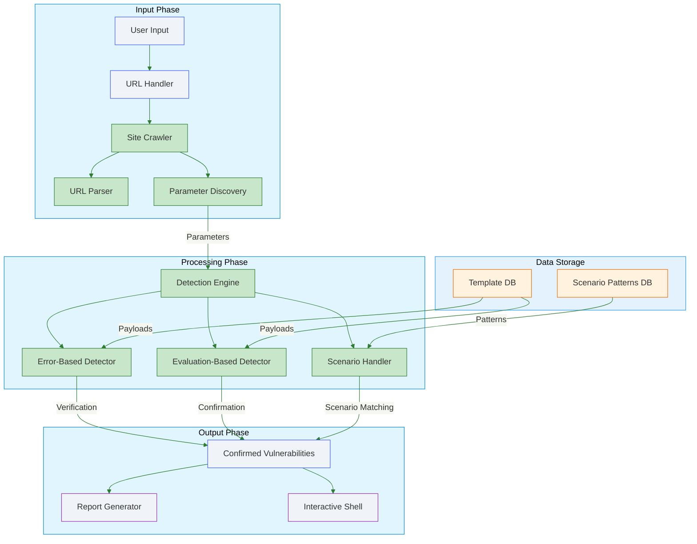
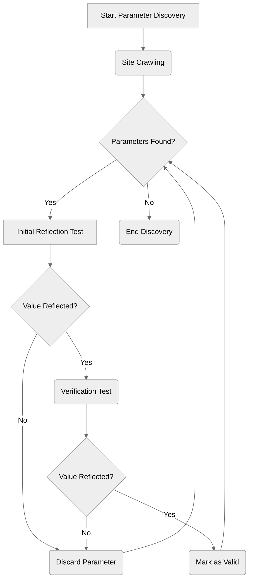
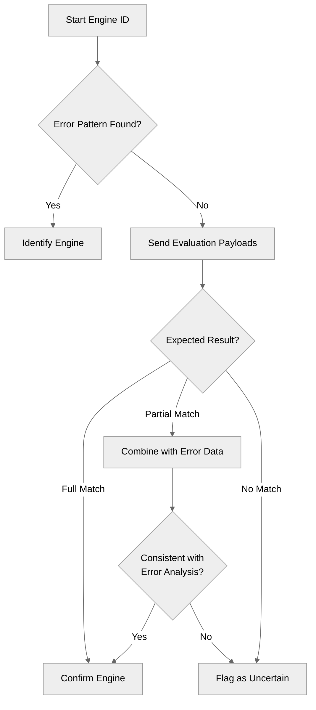
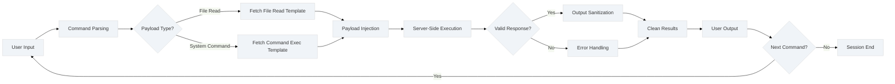
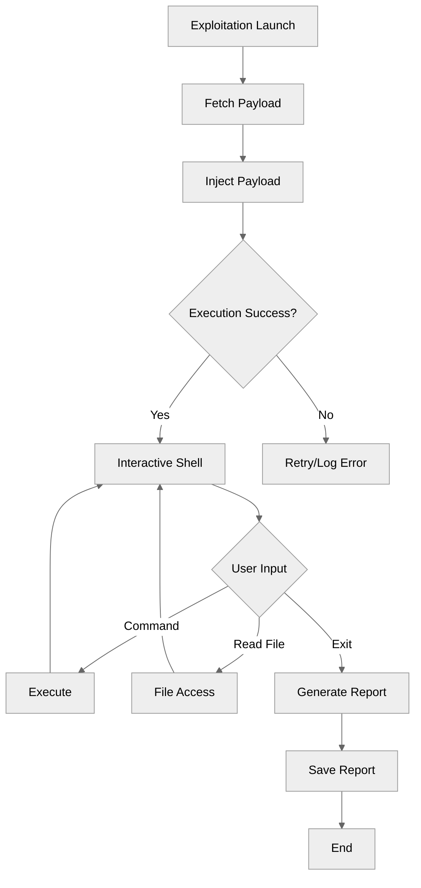

# 4.1.2.1 Architectural Foundation

## 1. Core Components

### System Building Blocks

| **Component**           | **Code Reference**                                           | **Purpose**                            |
| ----------------------- | ------------------------------------------------------------ | -------------------------------------- |
| Main Scanner Class      | `SSTIScanner`                                                | Coordinates scanning workflow          |
| Parameter Discovery     | `SiteCrawler`                                                | Finds input fields/URL parameters      |
| Vulnerability Detectors | `ErrorBasedEngineDetector` + `EvaluationBasedEngineDetector` | Confirms SSTI existence                |
| Exploitation System     | `SSTIExploiter`                                              | Executes attacks post-detection        |
| Payload Repository      | `TemplateDB`                                                 | Stores engine-specific payloads        |
| Scenario System         | `ScenarioHandler`                                            | Handles special cases/lab environments |


## **Technology Stack**

_Critical dependencies and their roles in the system:_

|**Library**|**Purpose**|**Usage Context**|
|---|---|---|
|`requests`|HTTP request handling with session persistence|Target interaction, vulnerability probing|
|`BeautifulSoup (bs4)`|HTML/XML parsing for parameter discovery|Site crawling, form extraction|
|`argparse`|Command-line interface (CLI) configuration|User input handling|
|`concurrent.futures`|Parallel execution of scanning tasks|Multi-threaded parameter testing|
|`re`|Regex pattern matching|Error analysis, payload detection|
|`urllib3`|Low-level HTTP client with SSL/TLS controls|Proxy configuration, warning suppression|
|`json`/`csv`|Report generation in structured formats|Output serialization|
|`datetime`|Timestamping of findings|Report metadata|


### **Key Library Explanations**

1. **`requests`**  
   - Manages all HTTP(S) communications  
   - Handles cookies, redirects, and proxy configurations  
   - Provides timeout controls for safe scanning  

2. **`BeautifulSoup`**  
   - Analyzes HTML structure during site crawling phase  
   - Extracts form parameters and hidden inputs  
   - Identifies reflection points in rendered content  

3. **`concurrent.futures.ThreadPoolExecutor`**  
   - Enables parallel scanning of multiple parameters  
   - Manages thread pool for reflection tests (Phase 2)  
   - Accelerates engine detection (Phase 3)  

4. **`argparse`**  
   - Processes command-line arguments (URLs, output format, etc)  
   - Implements help system and input validation  
   - Configures proxy settings and thread counts  

5. **`re`**  
   - Identifies template engine fingerprints in error messages  
   - Extracts executed command output between `TINJ_*` markers  
   - Validates parameter reflection through pattern matching  


### 2. Template Payload Database  
*Centralized repository for vulnerability patterns and exploit templates*  

**Key Roles**:  
- Stores engine fingerprints (regex patterns)  
- Contains validation payloads (e.g., `{{7*7}}`)  
- Provides exploit templates (command/file access)  
- Documents engine-specific constraints  

**Critical Integration Points**:  
- Used by `ErrorBasedEngineDetector` and `EvaluationBasedEngineDetector`  
- Accessed by `SSTIExploiter` during attack execution  
- Version-controlled via `template_db.json`  
---

##### Schema Overview  
```json
{
  "engines": {
    "EngineName": {
      "detection": {
        "error_regex": ["Pattern1", "Pattern2"],
        "evaluation": {
          "payload": "TEST_EXPRESSION",
          "expected": "EXPECTED_RESULT"
        },
        "reflection_markers": ["DELIMITERS"]
      },
      "exploit": {
        "command_exec": {
          "payload": "EXPLOIT_TEMPLATE",
          "description": "Usage context"
        },
        "file_read": {
          "payload": "FILE_ACCESS_TEMPLATE"
        }
      }
    }
  }
}
```


#### Key Components  

1. **Detection Signatures**  
   - `error_regex`: Patterns to identify engines from error messages  
   - `evaluation`: Mathematical tests to confirm template execution  
   - `reflection_markers`: Character sequences that indicate template context  

2. **Exploit Templates**  
   - `command_exec`: OS command injection payloads  
   - `file_read`: File system access patterns  
   - `reverse_shell`: Pre-built connection templates  


##### Integration with Scanning Workflow

1. **Detection Phase**
```python
# ErrorBasedEngineDetector uses error_regex
if re.search(pattern, response.text):
    identify_engine()
```

2. **Verification Phase**
```python
# EvaluationDetector uses evaluation payloads
send(TEMPLATE_DB["Jinja2"]["detection"]["evaluation"]["payload"])
```

3. **Exploitation Phase**
```python 
# SSTIExploiter retrieves payload templates
payload = TEMPLATE_DB[engine]["exploit"]["command_exec"]["payload"].replace("COMMAND", user_input)
```

## 3. Component Hierarchy

### Structural Relationships


**The scanner consists of 4 essential components:**

1. **Main Controller (SSTIScanner)**  
   - The brain of the system  
   - Manages the scanning workflow:  
     `URL Input → Parameter Discovery → Engine Detection → Exploitation`  
   - Handles threading and session management  

2. **Detection Tools**  
   - **Error Detector**: Looks for template engine fingerprints in error messages  
   - **Evaluation Detector**: Sends math payloads (e.g., `{{7*7}}`) to detect execution  
   - Work together to confirm vulnerabilities  

3. **Exploitation Engine (SSTIExploiter)**  
   - Takes verified vulnerabilities and:  
     - Executes system commands  
     - Reads files  
     - Maintains interactive sessions  

4. **Support Systems**  
   - **Site Crawler**: Discovers parameters by analyzing pages/forms  
   - **Template Database**: Stores engine-specific attack payloads  
   - **Scenario Handler**: Special logic for lab environments  


_______________________________________

# 4.1.2.2 Scanning Workflow


## Phase 1: Target Initialization  
*Prepares the scanning environment and validates the target*  

---

### GUI Interface Overview  
<!-- Insert actual GUI screenshot here -->
[GUI Input Interface](gui-screenshot-placeholder.png)  
*Caption: Scanner input interface showing configuration fields*

### User Inputs  
- **Target Specification**:  
  - Single URL (e.g., `https://example.com/search`)  
  - *OR* text file containing multiple URLs (one per line)  
- **Configuration Options**:  
  - Number of parallel scanning threads  
  - Proxy server address/port (optional)  
  - Output report format (JSON/CSV/XML)  
  - Specific parameters to test (optional list)  


### Input Flow Sequence  
![[Input Flow Sequence.svg]]
---

### Step 1: Session Setup  
- Creates persistent HTTP connection preserving:  
  - Authentication cookies  
  - Custom headers  
  - SSL/TLS session state  
- Disables SSL certificate verification for debugging  

---

### Step 2: Proxy Configuration  
- Applies user-provided proxy settings to all traffic  
- Supports both HTTP/HTTPS proxy types  
- Maintains connection reuse for efficiency  

---

### Step 3: Reachability Check  
1. Sends test request to first URL  
2. Validates response:  
   - **Success**: HTTP 200 status → Continue scan  
   - **Failure**:  
     - Invalid URL format → Terminates immediately  
     - Connection timeout → Logs error, skips URL  

---

### Step 4: Scenario Pre-Check  
- Scans initial response content for:  
  - Predefined vulnerability markers  
- Decision logic:  
  *If scenario pattern detected* → Specialized handling  
  *If no patterns found* → Standard scanning  

---

### Failure Handling  
- **Invalid URLs**: Terminates with format examples  
- **Unreachable targets**: Displays troubleshooting tips  
- **Proxy failures**: Attempts direct connection fallback  

---

*This phase only establishes working conditions - no vulnerability testing occurs here.*  


_________
_________
_________
_________

## Phase 2: Parameter Discovery  
*Identifies potential injection points through comprehensive analysis*  

---

### Key Objective:  
Find all user-controllable inputs that reflect values back in responses  

---

### Step 1: Site Crawling  
1. **Initial URL Analysis**  
   - Starts at user-provided URL  
   - Follows same-domain links up to configurable depth  
   - Preserves session cookies for authenticated areas  

2. **Multi-Source Extraction**  
   - **HTML Forms**:  
     - `<input>` fields (text/email/search types)  
     - `<textarea>` content  
     - Hidden parameters (`<input type="hidden">`)  
   - **URL Query Strings**:  
     - Parameters after `?` (e.g., `?search=test`)  
   - **Link Parameters**:  
     - URL parameters in `<a href="">` tags  

---

### Step 2: Reflection Verification  
**Strict Two-Stage Validation:**  
1. **Initial Test**  
   - Injects unique string (e.g., `TINJ_REFL_7BxY9z`)  
   - Checks exact match in:  
     - Response body content  
     - HTTP headers  
     - Redirect URLs  

2. **Confirmation Test**  
   - Sends different verification string (e.g., `TINJ_VERIF_4QwP2m`)  
   - Requires both strings to appear unmodified  

**Filter Logic:**  
Parameter survives only if:  
- Reflects both test values exactly  
- No encoding/truncation detected  
### Output Handling

- **Passed Parameters**: Queued for engine detection
    
- **Failed Parameters**: Permanently excluded
    
- **Discovery Report**:
```json
{
  "discovered_parameters": ["search", "email", "filter"],
  "reflected_parameters": ["search", "email"]
}
```

### Special Considerations

1. Avoids destructive operations during crawling
2. Limits recursion depth to prevent infinite loops




________

## Phase 3: Engine Identification  
*Determines the template engine through pattern analysis and execution testing*  

---

### Key Objective:  
Confirm the server-side template engine (e.g., Jinja2, Twig) using two verification methods  

---

### Step 1: Error Pattern Analysis  
**Method**:  
1. Sends malformed template syntax to trigger errors  
   - Example payload: `${<\%[%'}}%\`  
1. Analyzes error messages for fingerprints:  
   - **Jinja2**: Contains "jinja2.exceptions.TemplateSyntaxError"  
   - **Twig**: Shows "Twig_Error_Syntax"  
3. Records partial matches for secondary verification  

**Outcome**:  

If **Error Fingerprint Found** → High-confidence engine identification  
Else → Proceed to Step 2  

### Step 2: Evaluation-Based Detection  
**Method**:  
- Sends engine-specific arithmetic payloads:  
  - **Jinja2**: `{{7*'7'}}` → Expected output: `"7777777"`  
  - **Twig**: `{{7*7}}` → Expected output: `"49"`  
- Checks for mathematical execution evidence:  
  - Direct output match (e.g., `"49"` appears in response)  
  - Partial pattern match (e.g., `"777"` in truncated responses)  

**Verification Logic**:  
- **Full Match**: Confirms template engine definitively  
- **Partial Match**: Cross-references with error analysis results  
- **No Match**: Marks engine as "Unknown" for manual review  



__________
__________
__________
__________


## Phase 4: Post-Detection Actions  
*Executes payloads and delivers results after confirming vulnerabilities*  

---

### Key Objective:  
Leverage identified vulnerabilities for controlled exploitation and reporting  

---

### Step 1: Exploitation Launch  
**Process**:  
1. Retrieves engine-specific payloads from `TemplateDB`:  
   - **Command Execution**: `{{ self.__init__.__globals__... }}` (Jinja2)  
   - **File Read**: `${product.getClass()...}` (Freemarker)  
2. Injects payload into confirmed vulnerable parameter  
3. Validates command execution/output sanitization  

**Safety Measures**:  
- Timeout enforcement (15s default)  
- Payload sandboxing to prevent accidental damage  

---

### Step 2: Interactive Shell  
**Features**:  
- Real-time command execution interface  
- Context-aware parsing:  
  - `read /etc/passwd` → Auto-uses file read payload  
  - `whoami` → Uses command execution template  
- Output filtering to remove template artifacts  


**Example Flow**:

1. User types `whoami`
2. Tool selects command execution template for detected engine
3. Injects `{{ self.__init__...popen('whoami') }}`
4. Server returns `TINJ_STARTrootTINJ_END`
5. Tool displays cleaned output: `root`
---

### Step 3: Report Generation  

**Output Formats**:  

| **Format** | **Structure**                              | **Use Case**               |  
|------------|--------------------------------------------|----------------------------|  
| JSON       | Nested objects with full technical details | Developer analysis         |  
| CSV        | Tabular data with key fields               | Spreadsheet integration    |  
| XML        | Hierarchical vulnerability listing         | Enterprise system ingestion|  

**Report Contents**:  
- Vulnerable URL(s)  
- Confirmed parameter(s)  
- Template engine identified  
- Evidence snippets  
- Timestamp of discovery  

---

### Concurrency Management  
- Thread pool reused from earlier phases  
- Parallel tasks:  
  - Background report writing  
  - Shell input/output handling  
  - Payload retries on timeout  

---
This phase transforms detection results into actionable outcomes while maintaining operational safety.  




____________

