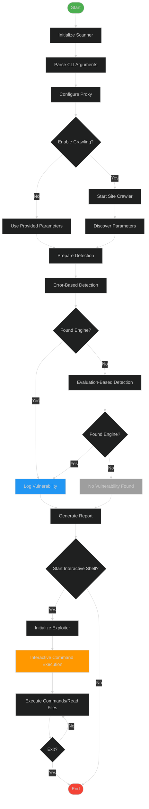

Key components mapped to your code:

1. **Site Crawler**: Handled by `SiteCrawler` class with BFS crawling
    
2. **Detection Methods**:
    
    - Error-based (`ErrorBasedEngineDetector`)
        
    - Evaluation-based (`EvaluationBasedEngineDetector`)
        
3. **Exploitation**:
    
    - `SSTIExploiter` class handling command execution/file reading
        
    - `interactive_shell` function for user interaction
        
4. **Reporting**:
    
    - JSON/CSV report generation in `generate_report`
        
5. **CLI Flow**:
    
    - Argument parsing and configuration
        
    - Proxy setup and verbosity control
        

Visual Features:

1. Color-coded nodes for different phases
    
2. Clear decision points (diamonds)
    
3. Parallel detection workflows
    
4. Interactive exploitation loop
    
5. Error handling paths